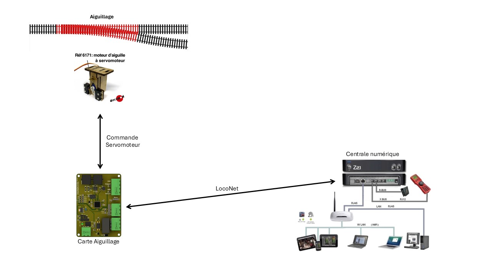
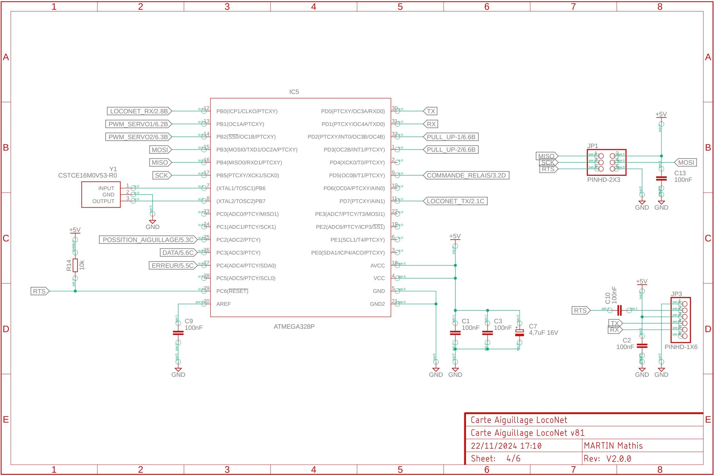
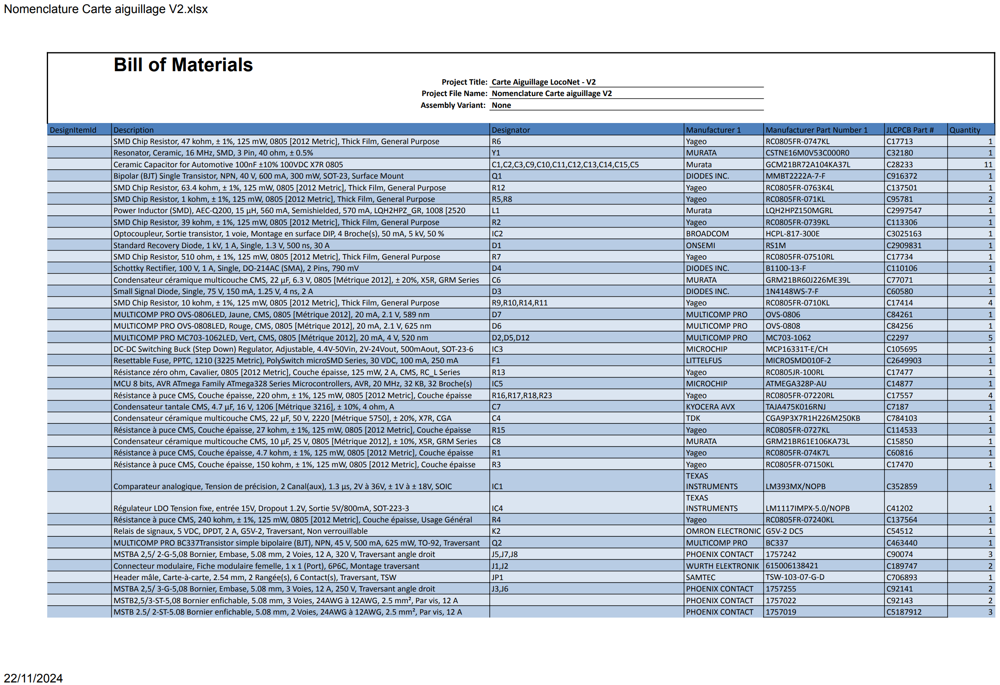

![PlatformIO Badge](https://img.shields.io/badge/build%20with-PlatformIO-orange?logo=data%3Aimage%2Fsvg%2Bxml%3Bbase64%2CPHN2ZyB3aWR0aD0iMjUwMCIgaGVpZ2h0PSIyNTAwIiB2aWV3Qm94PSIwIDAgMjU2IDI1NiIgeG1sbnM9Imh0dHA6Ly93d3cudzMub3JnLzIwMDAvc3ZnIiBwcmVzZXJ2ZUFzcGVjdFJhdGlvPSJ4TWlkWU1pZCI+PHBhdGggZD0iTTEyOCAwQzkzLjgxIDAgNjEuNjY2IDEzLjMxNCAzNy40OSAzNy40OSAxMy4zMTQgNjEuNjY2IDAgOTMuODEgMCAxMjhjMCAzNC4xOSAxMy4zMTQgNjYuMzM0IDM3LjQ5IDkwLjUxQzYxLjY2NiAyNDIuNjg2IDkzLjgxIDI1NiAxMjggMjU2YzM0LjE5IDAgNjYuMzM0LTEzLjMxNCA5MC41MS0zNy40OUMyNDIuNjg2IDE5NC4zMzQgMjU2IDE2Mi4xOSAyNTYgMTI4YzAtMzQuMTktMTMuMzE0LTY2LjMzNC0zNy40OS05MC41MUMxOTQuMzM0IDEzLjMxNCAxNjIuMTkgMCAxMjggMCIgZmlsbD0iI0ZGN0YwMCIvPjxwYXRoIGQ9Ik0yNDkuMzg2IDEyOGMwIDY3LjA0LTU0LjM0NyAxMjEuMzg2LTEyMS4zODYgMTIxLjM4NkM2MC45NiAyNDkuMzg2IDYuNjEzIDE5NS4wNCA2LjYxMyAxMjggNi42MTMgNjAuOTYgNjAuOTYgNi42MTQgMTI4IDYuNjE0YzY3LjA0IDAgMTIxLjM4NiA1NC4zNDYgMTIxLjM4NiAxMjEuMzg2IiBmaWxsPSIjRkZGIi8+PHBhdGggZD0iTTE2MC44NjkgNzQuMDYybDUuMTQ1LTE4LjUzN2M1LjI2NC0uNDcgOS4zOTItNC44ODYgOS4zOTItMTAuMjczIDAtNS43LTQuNjItMTAuMzItMTAuMzItMTAuMzJzLTEwLjMyIDQuNjItMTAuMzIgMTAuMzJjMCAzLjc1NSAyLjAxMyA3LjAzIDUuMDEgOC44MzdsLTUuMDUgMTguMTk1Yy0xNC40MzctMy42Ny0yNi42MjUtMy4zOS0yNi42MjUtMy4zOWwtMi4yNTggMS4wMXYxNDAuODcybDIuMjU4Ljc1M2MxMy42MTQgMCA3My4xNzctNDEuMTMzIDczLjMyMy04NS4yNyAwLTMxLjYyNC0yMS4wMjMtNDUuODI1LTQwLjU1NS01Mi4xOTd6TTE0Ni41MyAxNjQuOGMtMTEuNjE3LTE4LjU1Ny02LjcwNi02MS43NTEgMjMuNjQzLTY3LjkyNSA4LjMyLTEuMzMzIDE4LjUwOSA0LjEzNCAyMS41MSAxNi4yNzkgNy41ODIgMjUuNzY2LTM3LjAxNSA2MS44NDUtNDUuMTUzIDUxLjY0NnptMTguMjE2LTM5Ljc1MmE5LjM5OSA5LjM5OSAwIDAgMC05LjM5OSA5LjM5OSA5LjM5OSA5LjM5OSAwIDAgMCA5LjQgOS4zOTkgOS4zOTkgOS4zOTkgMCAwIDAgOS4zOTgtOS40IDkuMzk5IDkuMzk5IDAgMCAwLTkuMzk5LTkuMzk4em0yLjgxIDguNjcyYTIuMzc0IDIuMzc0IDAgMSAxIDAtNC43NDkgMi4zNzQgMi4zNzQgMCAwIDEgMCA0Ljc0OXoiIGZpbGw9IiNFNTcyMDAiLz48cGF0aCBkPSJNMTAxLjM3MSA3Mi43MDlsLTUuMDIzLTE4LjkwMWMyLjg3NC0xLjgzMiA0Ljc4Ni01LjA0IDQuNzg2LTguNzAxIDAtNS43LTQuNjItMTAuMzItMTAuMzItMTAuMzItNS42OTkgMC0xMC4zMTkgNC42Mi0xMC4zMTkgMTAuMzIgMCA1LjY4MiA0LjU5MiAxMC4yODkgMTAuMjY3IDEwLjMxN0w5NS44IDc0LjM3OGMtMTkuNjA5IDYuNTEtNDAuODg1IDIwLjc0Mi00MC44ODUgNTEuODguNDM2IDQ1LjAxIDU5LjU3MiA4NS4yNjcgNzMuMTg2IDg1LjI2N1Y2OC44OTJzLTEyLjI1Mi0uMDYyLTI2LjcyOSAzLjgxN3ptMTAuMzk1IDkyLjA5Yy04LjEzOCAxMC4yLTUyLjczNS0yNS44OC00NS4xNTQtNTEuNjQ1IDMuMDAyLTEyLjE0NSAxMy4xOS0xNy42MTIgMjEuNTExLTE2LjI4IDMwLjM1IDYuMTc1IDM1LjI2IDQ5LjM2OSAyMy42NDMgNjcuOTI2em0tMTguODItMzkuNDZhOS4zOTkgOS4zOTkgMCAwIDAtOS4zOTkgOS4zOTggOS4zOTkgOS4zOTkgMCAwIDAgOS40IDkuNCA5LjM5OSA5LjM5OSAwIDAgMCA5LjM5OC05LjQgOS4zOTkgOS4zOTkgMCAwIDAtOS4zOTktOS4zOTl6bS0yLjgxIDguNjcxYTIuMzc0IDIuMzc0IDAgMSAxIDAtNC43NDggMi4zNzQgMi4zNzQgMCAwIDEgMCA0Ljc0OHoiIGZpbGw9IiNGRjdGMDAiLz48L3N2Zz4=)

# Carte Aiguille LocoNet

 

- [Synoptique](#synoptique)
- [Installation Configuration et Câblage](#Installation-Configuration-et-Câblage)
- [Revue Technique](#revue-technique)

 

<table>
  <tr>
    <td></td>
    <td></td>
  </tr>
</table>

Dans un réseau de train miniature, il devient rapidement nécessaire de contrôler ses aiguillages à l'aide d'un ordinateur. C'est dans cette optique qu'a été créée une carte permettant de recevoir des ordres d'une centrale numérique du commerce par un bus (LocoNet) pour commander les aiguillages.

### Matériel
- Moteur d'aiguillage
- Carte aiguillage
- Z21 Noir avec routeur

### Logiciels
- RocRail
- Z21 application
- Fusion 360
- Visual Studio Code
- PlatformIO

## Synoptique

### Schéma d'utilisation

### Moteur d'aiguillage

<table>
  <tr>
    <th colspan="4">Moteurs compatibles</th>
  </tr>
  <tr>
    <td>Decapod</td>
    <td>MTB</td>
    <td>Cobalt Classic</td>
    <td>Fulgurex</td>
  </tr>
</table>

La carte Aiguillage a pour rôle de piloter un moteur d'aiguillage (servomoteur ou moteur standard) grâce à la commande reçue par le bus LocoNet.

> [!Caution]  
> Cette carte ne prend pas en charge les moteurs à impulsion.

### LocoNet

Le [LocoNet](documentation/Documentation_LocoNet.pdf) est un bus développé par Digitrax. Il permet de commander, grâce à une adresse, le changement de position du moteur, mais aussi de renvoyer l'état physique du moteur d'aiguillage grâce à des contacts, eux aussi associés à une adresse.

### Z21

La Z21 nous permet d'interfacer le bus LocoNet et un réseau local (LAN). Grâce à cela, il est possible de piloter nos aiguillages grâce à un logiciel type RocRail, RRTC, ou l'application Z21.

> [!IMPORTANT]  
> La Z21 Blanche ne comporte pas de bus LocoNet, elle n'est pas compatible.

## Installation Configuration et Câblage

### Câblage de la carte

Dans le cas d'un aiguillage Insulfrog, aucun cœur d'aiguillage n'est à câbler. Contrairement à l'Electrofrog où il faut modifier l'aiguillage pour pouvoir avoir une utilisation optimale.

Schéma des entrées et sorties de la carte :

 

<table>
  <tr>
    <th colspan="4">Câblage en fonction du type d'aiguillage</th>
  </tr>
  <tr>
    <td>Aiguillage simple</td>
    <td>Aiguillage tjd/tjs</td>
    <td>Aiguillage triple</td>
    <td>Aiguillage en tête-bêche</td>
  </tr>
</table>

> [!IMPORTANT]  
> Pour une utilisation des aiguillages en tête-bêche, il est nécessaire d'utiliser un Y pour commander les deux servomoteurs.
>
> 

 

> [!IMPORTANT]  
> Dans le cas des moteurs standards DC (MTB, Fulgurex...), utilisez les contacts du relais pour les piloter.

### Configuration de la carte

Le menu est contrôlé par une série de commandes qui permettent à l'utilisateur de naviguer à travers les options de configuration et de voir les réglages actuels. Voici les commandes disponibles et leur effet :

- **R** : Voir les réglages actuels de la carte.
- **M** : Régler le point milieu du servomoteur.
- **P** : Régler la fin de course gauche et droite du servo.
- **A** : Régler l'adresse de commande de l'aiguillage.
- **D** : Régler l'adresse de détection.
- **N** : Régler le nombre de moteurs d'aiguillage.
- **S** : Régler le sens logique du moteur d'aiguillage.
- **I** : Isoler la carte.
- **E** : Quitter le mode de configuration.
- **?** : Afficher le menu d'aide.

Pour utiliser ces commandes, entrez la lettre correspondante et appuyez sur 'Entrée'. Le système répondra en fonction de la commande entrée et vous dirigera vers le menu ou l'action appropriée.

## Revue Technique

Ce projet utilise un microcontrôleur ATmega328P pour la gestion des aiguillages d'un réseau de modélisme ferroviaire. Il intègre des servomoteurs pour les aiguillages, le protocole LocoNet pour la communication, et fournit des retours visuels via des LED.

### Brochage des Pins

 

| GPIO   | PIN  | Fonction                          |
|--------|------|-----------------------------------|
| GPIO 9 | 13   | Servo 1                           |
| GPIO 10| 14   | Servo 2 (fonctionnalité en cours) |
| GPIO 7 | 11   | LocoNet TX                        |
| GPIO 8 | 12   | LocoNet RX                        |
| GPIO 5 | 9    | Relais                            |
| GPIO 2 | 1    | Pull-UP 1                         |
| GPIO 3 | 32   | Pull-UP 2                         |
| GPIO 16| 25   | LED position aiguillage           |
| GPIO 17| 26   | LED DATA                          |
| GPIO 18| 27   | LED ERREUR                        |

### Schéma structurel

[Lien vers le schéma structurel complet de la carte](documentation/Schema_Carte_Aiguillage.pdf)

### Nomenclature (BOM)

[Nomenclature Carte aiguillage V2](documentation/Nomenclature%20Carte%20aiguillage%20V2.pdf)

Liste des composants principaux avec leur documentation.

| **Nom du Composant**  | **Description**                 |
|-----------------------|---------------------------------|
| [ATmega328P](documentation/ATmega328P.pdf)            | Microcontrôleur                 |
| [MCP16331T-E/CH](documentation/MCP16331.pdf)        | Régulateur DC-DC (500 mA)       |
| [LM1117IMPX-5.0/NOPB](documentation/LM1117.pdf)   | Régulateur 5V (800 mA)          |
| [MICROSMD010F-2](documentation/MICROSMD010F.pdf)        | Fusible auto-réarmable (250 mA) |
| [LM393MX/NOPB](documentation/LM393.pdf)          | AOP bus LocoNet                 |
| [G5V-2 DC5](documentation/relais.pdf)             | Relais 5V                       |
| [MSTBA2,5](documentation/MSTB2.5femelle.pdf)               | Connecteur femelle PHOENIX CONTACT      |
| [MSTB2,5](documentation/MSTB2.5male.pdf)               | Connecteur mâle PHOENIX CONTACT      |

### Câblage du LocoNet

[La norme de câblage du Digitrax RJ12 LocoNet](documentation/Cablage_loconet.pdf)

&copy; 2024 Réseau Jeune - Rail Club ModelSat - MARTIN Mathis